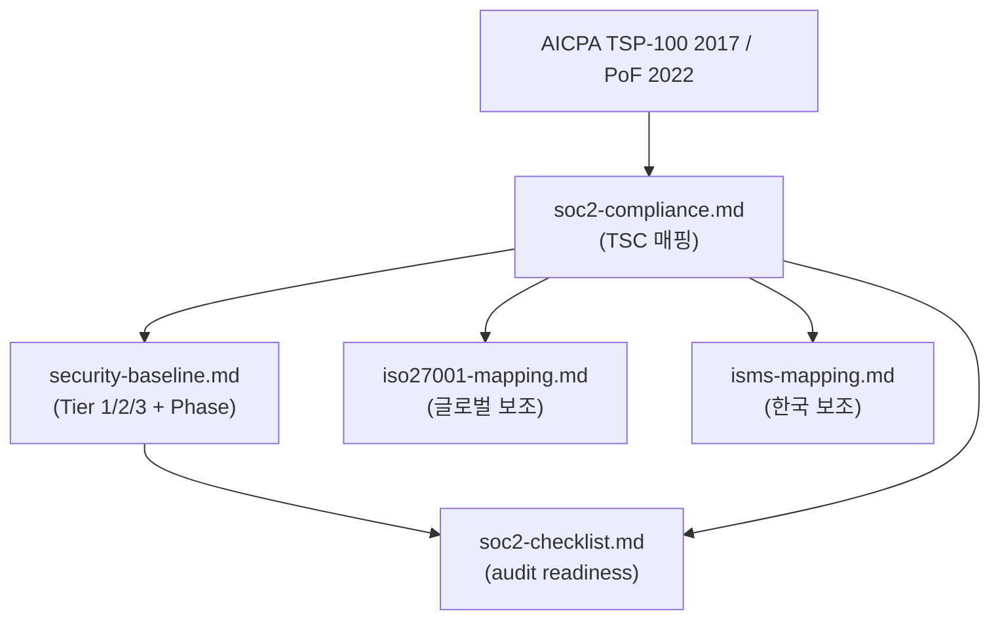

# Security Docs Index

eks-bootstrap의 보안 문서 5종 + 본 인덱스. 글로벌 SaaS 사업 audit-readiness 목적.

## 파일 맵

```
docs/security/
├── README.md             (본 인덱스)
├── security-baseline.md  (기술 baseline + Tier/Phase 매트릭스)
├── soc2-compliance.md    (전체 33 CC enumerate + 영역 분류 + audit timeline)
├── soc2-checklist.md     (audit-ready checklist + evidence map)
├── iso27001-mapping.md   (글로벌 사업 보조)
└── isms-mapping.md       (한국 시장 보조)
```

## 읽는 순서

목적별 entry point:

| 목적 | 시작 |
|---|---|
| "지금 무엇을 박아야 하나" | [security-baseline.md](security-baseline.md) → Tier 1 표 |
| "SOC 2가 우리 코드에 어떻게 매핑되나" | [soc2-compliance.md](soc2-compliance.md) → TSC 표 |
| "audit 앞두고 무엇을 점검하나" | [soc2-checklist.md](soc2-checklist.md) → Type I readiness |
| "글로벌 사업 (EU/아시아) 진출 시" | [iso27001-mapping.md](iso27001-mapping.md) |
| "한국 시장 진출 시" | [isms-mapping.md](isms-mapping.md) |
| "Plan 작성 중 보안 영향 검토" | [soc2-compliance.md](soc2-compliance.md) + [security-baseline.md Tier](security-baseline.md#우선순위-분류--구축-시-박을-것-vs-후속-추가) |

## 책임 분담

| 문서 | 답하는 질문 | 변경 주기 |
|---|---|---|
| `security-baseline.md` | *무엇을* *언제까지* 박아야 하나 | 모듈 추가 시 |
| `soc2-compliance.md` | 33개 CC 전체 + 각 영역(기술/혼합/조직/AWS-inherited)·owner·매핑 | TSC 매핑 갱신 시 |
| `soc2-checklist.md` | audit 전 무엇을 점검하나 | audit 라운드별 |
| `iso27001-mapping.md` | ISO 27001 Annex A 자동 충족 / 갭 | 인증 추진 시 |
| `isms-mapping.md` | ISMS-P 자동 충족 / 갭 (한국 한정) | 인증 추진 시 |

## 문서 간 관계



## 리뷰 포커스 (전체)

각 문서 상단에도 `## 리뷰 포커스` 섹션 있음. 전체 리뷰 시 우선 점검할 5가지:

1. **Tier 1 immutable 항목 (security-baseline)** — day 1에 빼면 변경 매우 비싸거나 불가능. 11개 항목이 첫 plan에 모두 반영되는지.
2. **Industry-common interpretation (soc2-compliance)** — CC1.5 / CC3.4 / CC4.2 / CC5.1~5.3 매핑. AICPA 명시 X, audit firm마다 해석 차이 가능. 사전 협의 필요.
3. **항목 명칭 일관성 (전체)** — 같은 통제가 5개 문서 중 여러 곳에 등장. 항목명이 동일한지 (예: "EKS Secret KMS CMK envelope" — 동일 표기 유지).
4. **Phase 매핑 정합성 (soc2-compliance + security-baseline)** — 같은 통제의 Phase 값이 모순 없는지.
5. **Annex A 번호 정확성 (iso27001-mapping)** — ISO/IEC 27001:2022 표준 번호 (A.5.x, A.8.x 등)와 실제 standard 일치.

## 우선순위 분류 (요약)

상세는 [security-baseline.md](security-baseline.md#우선순위-분류--구축-시-박을-것-vs-후속-추가). 짧게:

- **Tier 1** — 첫 Terraform apply에 반드시 (immutable 또는 재생성 비용 매우 큼). 11개 항목.
- **Tier 2** — Phase 1 후반 / Phase 2 (운영 중 추가 가능, evidence 일관성 위해 빨리). 14개 항목.
- **Tier 3** — Phase 3+ (운영 시작 후 자유롭게 추가). 11개 항목.

## Audit Timeline (요약)

상세는 [soc2-compliance.md](soc2-compliance.md#audit-timeline-type-i-vs-type-ii).

| Phase | Audit 후보 |
|---|---|
| Phase 2 baseline 완료 | Type I (point-in-time) |
| Phase 2 + 6~12개월 운영 | Type II first-time |
| Annual | Type II recurring |

## Style 규칙 (본 디렉토리 모든 보안 문서 공통)

- 각 문서 상단에 `## 리뷰 포커스` 섹션 5줄 이하.
- 표 컬럼 헤더: `항목` / `Tier` / `Phase` / `비고` (또는 유사). 같은 의미는 같은 이름.
- Phase 범위: `Phase 1~2` (한국식 tilde).
- 핵심 항목명 굵게 (`**EKS Secret KMS CMK envelope**` 같은 식).
- 상태 값: 적용 / 부분 / 미적용.
- 참조 링크: 동일 디렉토리 `[file.md](file.md)`, 상위 `[file](../path/file.md)`.

## Quick Map (항목 → Tier × Phase)

전체 보안 항목을 한 표로 cross-reference. 상세는 [security-baseline.md](security-baseline.md).

| 항목 | Tier | Phase |
|---|---|---|
| AWS account EBS default encryption | T1 | 사전 조건 |
| Root account MFA | T1 | 사전 조건 |
| Region default CloudTrail (활성 확인) | - | 사전 조건 |
| S3 tfstate Object Lock | T1 | 1 |
| S3 tfstate versioning + SSE + public access block + `prevent_destroy` | T1 | 1 |
| VPC CIDR + subnet 구조 (private/public 분리) | T1 | 1 |
| EKS Secret KMS CMK envelope | T1 | 1 |
| EKS `authentication_mode = API` | T1 | 1 |
| EKS control plane logs 5종 | T1 | 1 |
| Aurora `storage_encrypted` + CMK | T1 | 1 |
| Aurora cluster identifier 명명 | T1 | 1 |
| IMDSv2 (MNG·Karpenter 노드) | T1 | 1 |
| commit-gates (gitleaks, tfsec, fmt, validate, tflint) | T2 | 1 후반 |
| CloudTrail multi-region trail + log file validation | T2 | 1 후반 |
| Log retention 365일 상향 (CloudWatch·S3) | T2 | 2 |
| KMS CMK rotation 활성 (annual) | T2 | 2 |
| EBS·RDS·tfstate CMK 적용 | T2 | 2 |
| ALB access logs S3 | T2 | 2 |
| VPC Flow Logs S3 | T2 | 2 |
| mTLS (Temporal frontend) | T2 | 2 |
| ArgoCD GitHub OAuth + local admin 비활성 | T2 | 2 |
| ESO (External Secrets Operator) | T2 | 2 |
| RDS pgAudit (`shared_preload_libraries`) | T2 | 2 |
| Aurora `force_ssl = 1` | T2 | 1~2 |
| Secrets Manager rotation Lambda | T2 | 2 |
| GuardDuty / Security Hub / Config / Inspector | T3 | 3 |
| WAF on public ALB | T3 | 3 |
| Pod Security Standards `restricted` | T3 | 3 |
| Kyverno / Gatekeeper | T3 | 3 |
| NACL (defense-in-depth, SG와 별도) | T3 | 3 |
| CloudTrail centralized account 분리 | T3 | 3 |
| AWS Backup plans | T3 | 3 |
| Aurora Multi-AZ provisioned + PITR 7일+ | T3 | 3 |
| S3 Object Lock on other audit log buckets (CloudTrail/ALB/VPC Flow) | T3 | 2~3 (해당 bucket 생성 시점) |
| Confidentiality 통제 (C1.1 데이터 분류, C1.2 파기) | T3 | 3 |

검증: T1 11건, T2 13건, T3 10건. 합계 34 + 사전 조건 3건 = 37 항목.

## References

- [security-baseline.md](security-baseline.md)
- [soc2-compliance.md](soc2-compliance.md)
- [soc2-checklist.md](soc2-checklist.md)
- [iso27001-mapping.md](iso27001-mapping.md)
- [isms-mapping.md](isms-mapping.md)
